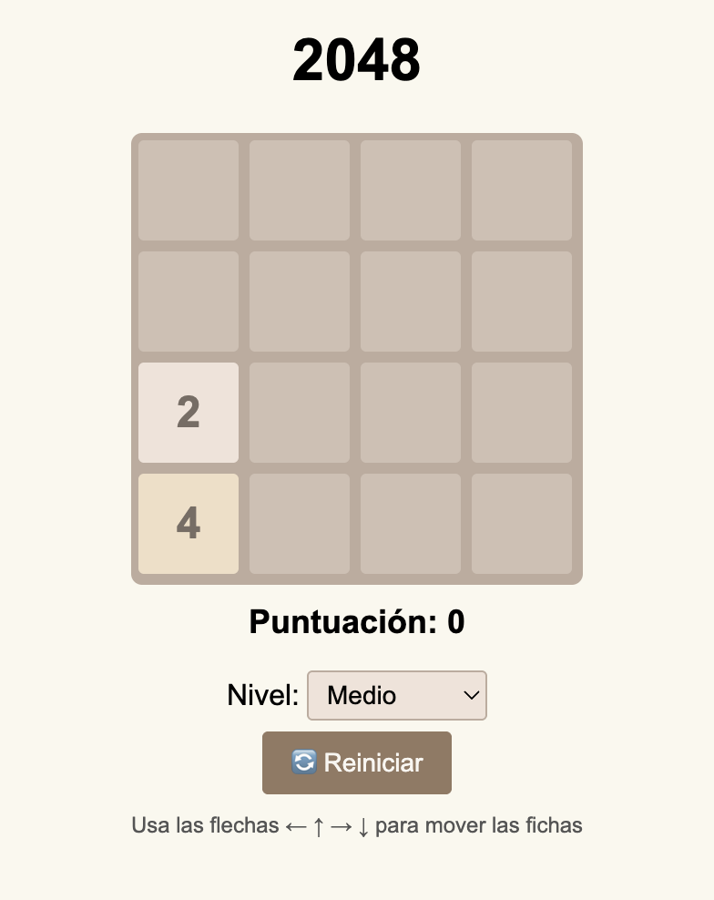

<div align="center">

# 🎮 2048 Chrome Extension 🎮



*Extensión de Chrome que permite jugar el clásico **2048** directamente desde el popup del navegador*

[](https://opensource.org/licenses/MIT)
[](https://chrome.google.com/webstore)

</div>

## ✨ Características

- 🎲 Juego 2048 completo en HTML/CSS/JS sin dependencias externas.
- 🔄 Selección de **nivel de dificultad** (Fácil, Medio, Difícil, Muy Difícil) que ajusta la probabilidad de aparición de fichas 2/4.
- 🖼️ Iconos personalizados incluidos (16-128 px).
- 📝 Código y estilos comentados para facilitar el mantenimiento.

## 💻 Estructura del proyecto

```
Proyecto_01/
├── icons/           # Iconos PNG para el manifest
├── img/             # Imágenes para documentación
├── index.html       # Interfaz del popup
├── styles.css       # Estilos del juego
├── script.js        # Lógica de 2048
├── manifest.json    # Configuración MV3 de la extensión
└── README.md        # Este archivo
```

## 🔧 Instalación en modo desarrollador

1. 💾 Clona o descarga este repositorio.
2. 🌐 Abre `chrome://extensions/` y activa **Modo desarrollador**.
3. ⬆️ Pulsa **Cargar descomprimida** y selecciona la carpeta del proyecto.
4. 🔍 Haz clic en el icono de la extensión para abrir el juego.

## 💬 Publicación en Chrome Web Store

1. 📦 Comprime los archivos (sin la carpeta raíz) en un `.zip`.
2. ⬆️ Sube el paquete en la consola de desarrolladores de Chrome Web Store.
3. 📝 Completa la ficha de la extensión, sube capturas y publica.

## 👪 Contribuciones

Las pull requests son bienvenidas. Para cambios mayores, abre primero un *issue* para discutir lo que quieres modificar.

## 📃 Licencia

MIT © 2025 686f6c61

---

<div align="center">
Desarrollado con ❤️ por <a href="https://github.com/686f6c61">686f6c61</a>
</div>
